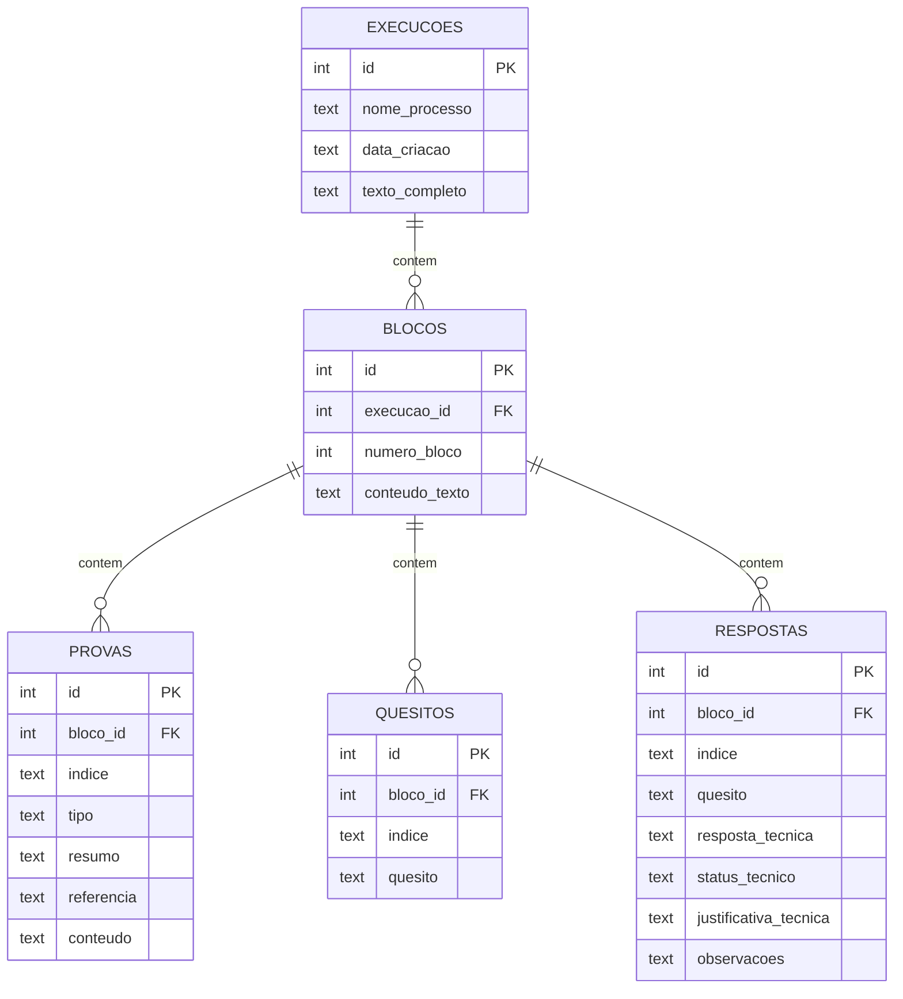

# Modelo de Dados (data-model.md) - Banco de Dados SQLite

Este documento descreve o modelo físico de dados em SQLite para armazenar as execuções e resultados do **EVID**.

---

## 1. Diagrama de Relacionamento (Conceitual)



---

## 2. Esquema DDL (SQLite)

```sql
-- Tabela de Execuções
CREATE TABLE IF NOT EXISTS execucoes (
    id INTEGER PRIMARY KEY AUTOINCREMENT,
    nome_processo TEXT NOT NULL,
    data_criacao TEXT NOT NULL,
    texto_completo TEXT
);

-- Tabela de Blocos
CREATE TABLE IF NOT EXISTS blocos (
    id INTEGER PRIMARY KEY AUTOINCREMENT,
    execucao_id INTEGER NOT NULL,
    numero_bloco INTEGER NOT NULL,
    conteudo_texto TEXT,
    FOREIGN KEY (execucao_id) REFERENCES execucoes(id) ON DELETE CASCADE
);

-- Tabela de Provas
CREATE TABLE IF NOT EXISTS provas (
    id INTEGER PRIMARY KEY AUTOINCREMENT,
    bloco_id INTEGER NOT NULL,
    indice TEXT,
    tipo TEXT,
    resumo TEXT,
    referencia TEXT,
    conteudo TEXT,
    FOREIGN KEY (bloco_id) REFERENCES blocos(id) ON DELETE CASCADE
);

-- Tabela de Quesitos
CREATE TABLE IF NOT EXISTS quesitos (
    id INTEGER PRIMARY KEY AUTOINCREMENT,
    bloco_id INTEGER NOT NULL,
    indice TEXT,
    quesito TEXT,
    FOREIGN KEY (bloco_id) REFERENCES blocos(id) ON DELETE CASCADE
);

-- Tabela de Respostas
CREATE TABLE IF NOT EXISTS respostas (
    id INTEGER PRIMARY KEY AUTOINCREMENT,
    bloco_id INTEGER NOT NULL,
    indice TEXT,
    quesito TEXT,
    resposta_tecnica TEXT,
    status_tecnico TEXT,
    justificativa_tecnica TEXT,
    observacoes TEXT,
    FOREIGN KEY (bloco_id) REFERENCES blocos(id) ON DELETE CASCADE
);
```

---

## 3. Índices de Desempenho e Busca
Para otimizar os filtros de pesquisa e o carregamento do histórico, criaremos os seguintes índices adicionais:
```sql
CREATE INDEX IF NOT EXISTS idx_execucoes_nome ON execucoes(nome_processo);
CREATE INDEX IF NOT EXISTS idx_execucoes_data ON execucoes(data_criacao);
CREATE INDEX IF NOT EXISTS idx_blocos_execucao ON blocos(execucao_id);
CREATE INDEX IF NOT EXISTS idx_provas_bloco ON provas(bloco_id);
CREATE INDEX IF NOT EXISTS idx_quesitos_bloco ON quesitos(bloco_id);
CREATE INDEX IF NOT EXISTS idx_respostas_bloco ON respostas(bloco_id);
```
